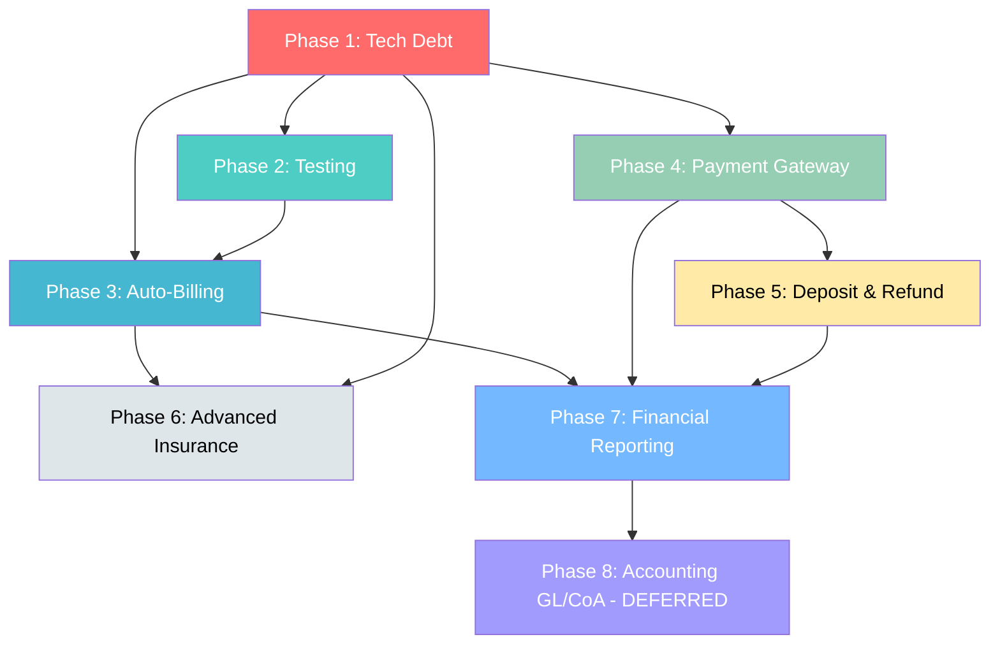

# Finance Module Implementation Plan

**Project:** Hospital Management System (HMS)  
**Module:** Finance Module Enhancement  
**Version:** 1.0  
**Date:** January 31, 2025  
**Prepared by:** TeaBot  
**Status:** Ready for Review  

---

## Executive Summary

This implementation plan details the phased rollout of the Finance Module enhancements for the HMS, covering 7 major modules across 8 phases. The plan prioritizes **technical debt fixes** and **data integrity** before adding new features, ensuring existing billing, payment, and insurance workflows remain stable throughout the implementation.

**Timeline:** 16 weeks (8 two-week sprints)  
**Team:** Full-stack developers (2-3), QA engineer (1)  
**Risk Level:** Medium (mitigated through feature flags and phased rollout)

---

## Table of Contents

1. [Current State Analysis](#1-current-state-analysis)
2. [Implementation Phases](#2-implementation-phases)
3. [Phase-by-Phase Breakdown](#3-phase-by-phase-breakdown)
4. [Sprint Plan](#4-sprint-plan)
5. [Safety Measures](#5-safety-measures)
6. [Risk Register](#6-risk-register)
7. [Dependencies Map](#7-dependencies-map)
8. [Testing Strategy](#8-testing-strategy)
9. [Rollback Plans](#9-rollback-plans)
10. [Success Metrics](#10-success-metrics)

---

## 1. Current State Analysis

### 1.1 Existing Codebase Structure

**Backend:**
- `backend/src/services/billingService.ts` (751 lines) — Core billing logic
- `backend/src/routes/billingRoutes.ts` (189 lines) — API endpoints
- `backend/prisma/schema.prisma` — Data models: Invoice, Payment, InsuranceClaim

**Frontend:**
- `frontend/src/pages/Billing/index.tsx` (1,380+ lines) — Admin billing dashboard
- `frontend/src/pages/PatientPortal/Billing.tsx` (1,100+ lines) — Patient billing view

**Testing:**
- ✅ E2E tests exist (Playwright) for lab/IPD workflows
- ❌ **Zero backend unit/integration tests** (critical gap)
- ❌ **Zero frontend tests** (needs Vitest setup)

### 1.2 Key Issues Identified

| Issue | Impact | Location |
|-------|--------|----------|
| **Non-atomic payment processing** | Data corruption risk | `billingService.ts:143-199` |
| **Hardcoded 'SYSTEM' user** | Audit trail gap | `billingService.ts:238` |
| **Missing audit fields** | Compliance failure | `schema.prisma` Invoice/Payment/Claim models |
| **No payment validation** | Overpayment risk | `billingService.ts:143-156` |
| **Hardcoded charge database** | Multi-hospital blocker | `billingService.ts:435-485` |
| **No unique constraint on Payment.referenceNumber** | Duplicate payment risk | `schema.prisma:1950` |

### 1.3 Impact on Existing Features

The following existing features will be **touched but preserved**:

| Feature | Impact Level | Protection Strategy |
|---------|-------------|---------------------|
| Invoice creation (`POST /api/v1/billing/invoices`) | **Medium** | Wrap in feature flag, add unit tests before changes |
| Payment recording (`POST /api/v1/billing/invoices/:id/payments`) | **High** | Transaction refactoring is additive, validate against existing invoices |
| Insurance claim submission (`POST /api/v1/billing/invoices/:id/claims`) | **High** | Schema changes are additive only, no field deletions |
| Patient billing statement | **Low** | Read-only, no breaking changes expected |
| AI charge capture endpoints | **Low** | Migrate to DB-backed ChargeMaster, preserve API contract |

---

## 2. Implementation Phases

| Phase | Module | Duration | Sprint(s) | Priority | Risk |
|-------|--------|----------|-----------|----------|------|
| **Phase 1** | Technical Debt Fixes | 2 weeks | Sprint 1 | P0 - Critical | High (touches core flows) |
| **Phase 2** | Testing Infrastructure | 1 week | Sprint 2 (first half) | P1 - High | Low |
| **Phase 3** | Auto-Billing Engine | 2 weeks | Sprint 2-3 | P1 - High | Medium |
| **Phase 4** | Payment Gateway Integration | 2 weeks | Sprint 4 | P1 - High | Medium |
| **Phase 5** | Deposit & Refund Management | 2 weeks | Sprint 5 | P1 - High | Low |
| **Phase 6** | Advanced Insurance Workflow | 3 weeks | Sprint 6-7 | P1 - High | Medium |
| **Phase 7** | Financial Reporting | 2 weeks | Sprint 7-8 | P1 - High | Low |
| **Phase 8** | Accounting Foundation (GL/CoA) | 2 weeks | Sprint 8+ | P3 - Low | Low (future phase) |

**Total:** 16 weeks (8 sprints) for Phases 1-7  
**Note:** Phase 8 (Accounting Foundation) can be deferred to a future release.

---

## 3. Phase-by-Phase Breakdown

---

## Phase 1: Technical Debt Fixes (2 weeks | Sprint 1)

**Objective:** Fix critical data integrity and audit compliance issues before adding new features.

### 3.1 Tasks & Effort

| Task ID | Task | Effort (days) | Assignee Role |
|---------|------|---------------|---------------|
| P1-001 | Add `createdBy`, `updatedBy` fields to Invoice/Payment/InsuranceClaim models | 1 | Backend Dev |
| P1-002 | Create Prisma migration for audit fields | 0.5 | Backend Dev |
| P1-003 | Update `billingService.ts` to accept and store user IDs | 1.5 | Backend Dev |
| P1-004 | Update `billingRoutes.ts` to pass `req.user.userId` to service methods | 0.5 | Backend Dev |
| P1-005 | Wrap payment recording + invoice update in `prisma.$transaction()` | 1 | Backend Dev |
| P1-006 | Add payment amount validation (cannot exceed invoice balance) | 0.5 | Backend Dev |
| P1-007 | Wrap insurance claim approval + auto-payment in single transaction | 1 | Backend Dev |
| P1-008 | Replace `receivedBy: 'SYSTEM'` with actual user ID from claim processor | 0.5 | Backend Dev |
| P1-009 | Add unique constraint on `Payment.referenceNumber` (when not null) | 0.5 | Backend Dev |
| P1-010 | Add authorization checks to AI charge capture endpoints (3 routes) | 0.5 | Backend Dev |
| P1-011 | Link `InsuranceClaim.insuranceProvider` to `InsurancePayer` table (FK) | 1 | Backend Dev |
| P1-012 | Add `denialReasonCode`, `submittedBy`, `processedBy` to InsuranceClaim | 0.5 | Backend Dev |
| P1-013 | Manual testing: Payment flow, claim approval, invoice cancellation | 1 | QA |

**Total Effort:** 10 days (2 weeks)

### 3.2 Files to Create/Modify

**Schema Changes:**
```prisma
// backend/prisma/schema.prisma

model Invoice {
  // ... existing fields ...
  createdBy String  @db.Uuid
  updatedBy String? @db.Uuid
}

model Payment {
  // ... existing fields ...
  createdBy String @db.Uuid  // Replace receivedBy with FK
}

model InsuranceClaim {
  // ... existing fields ...
  createdBy           String  @db.Uuid
  updatedBy           String? @db.Uuid
  submittedBy         String? @db.Uuid
  processedBy         String? @db.Uuid
  denialReasonCode    String?
  appealNotes         String?
  appealDate          DateTime?
  appealStatus        String?
  insurancePayerId    String? @db.Uuid  // FK to InsurancePayer
  insurancePayer      InsurancePayer? @relation(fields: [insurancePayerId], references: [id])
}
```

**Backend Service:**
- `backend/src/services/billingService.ts`
  - Update `createInvoice()` to accept `createdBy`
  - Update `addPayment()` to wrap in `$transaction` and validate amount
  - Update `updateClaimStatus()` to wrap in `$transaction` and accept `processedBy`
  - Remove `receivedBy: 'SYSTEM'` hardcode

**Backend Routes:**
- `backend/src/routes/billingRoutes.ts`
  - Pass `req.user.userId` as `createdBy` to all create/update calls
  - Add `authorizeWithPermission()` to AI endpoints (lines 158-189)

### 3.3 Database Migration Steps

```bash
# Generate migration
cd backend
npx prisma migrate dev --name add_audit_fields_to_billing

# Review generated SQL
# Verify:
# - ALTER TABLE invoices ADD COLUMN created_by UUID NOT NULL;
# - ALTER TABLE invoices ADD COLUMN updated_by UUID;
# - ALTER TABLE payments ALTER COLUMN received_by TYPE UUID USING received_by::uuid;
# - ALTER TABLE payments ADD CONSTRAINT fk_payment_created_by ...
# - ... (similar for InsuranceClaim)

# Apply to development
npx prisma migrate deploy

# Backfill createdBy for existing records (use SYSTEM user or admin)
node scripts/backfill-audit-fields.js
```

**Backfill Script:**
```javascript
// backend/scripts/backfill-audit-fields.js
const prisma = new PrismaClient();

async function backfill() {
  const systemUserId = '<SYSTEM_USER_UUID>'; // Hospital admin user
  
  await prisma.invoice.updateMany({
    where: { createdBy: null },
    data: { createdBy: systemUserId }
  });
  
  await prisma.payment.updateMany({
    where: { createdBy: null },
    data: { createdBy: systemUserId }
  });
  
  // ... similar for InsuranceClaim
}

backfill();
```

### 3.4 Testing Requirements

**Unit Tests (New):**
- ✅ `billingService.test.ts`:
  - `addPayment()` rejects amount exceeding balance
  - `addPayment()` + invoice update are atomic (mock Prisma transaction)
  - `updateClaimStatus()` + auto-payment are atomic
  - Audit fields are populated on create/update

**Integration Tests (New):**
- ✅ `POST /api/v1/billing/invoices` returns `createdBy` in response
- ✅ `POST /api/v1/billing/invoices/:id/payments` rejects overpayment (400)
- ✅ Payment + invoice update rollback on failure (simulate DB error)

**Manual Testing:**
- ✅ Create invoice → verify `createdBy` is logged
- ✅ Record payment exceeding balance → verify rejection
- ✅ Approve insurance claim → verify auto-payment has correct `createdBy`

### 3.5 Impact Analysis

**Affected Existing Features:**
- ✅ **Invoice creation:** Additive (new fields), existing API works
- ✅ **Payment recording:** Behavior change (validation), but prevents bugs
- ✅ **Insurance claim approval:** Behavior change (transaction), improves reliability

**Backward Compatibility:**
- ✅ API contracts unchanged (new fields optional in responses)
- ✅ Frontend can ignore new audit fields (display enhancement is Phase 7)
- ❌ **Breaking change:** `receivedBy` changes from String to UUID (requires data migration)

**Mitigation:**
- Backfill `receivedBy` with a system user UUID before migration
- Deploy backend first, frontend update can follow later

---

## Phase 2: Testing Infrastructure (1 week | Sprint 2 - First Half)

**Objective:** Establish backend testing framework before building new features.

### 3.6 Tasks & Effort

| Task ID | Task | Effort (days) | Assignee Role |
|---------|------|---------------|---------------|
| P2-001 | Create `backend/jest.config.ts` with Prisma mocking | 0.5 | Backend Dev |
| P2-002 | Setup `@prisma/client` mocking in test environment | 0.5 | Backend Dev |
| P2-003 | Create test factories for Invoice, Payment, Patient, User | 1 | Backend Dev |
| P2-004 | Write unit tests for existing `billingService.ts` methods | 2 | Backend Dev |
| P2-005 | Write integration tests for `billingRoutes.ts` (5 endpoints) | 1 | Backend Dev |

**Total Effort:** 5 days (1 week)

### 3.7 Files to Create

**Jest Configuration:**
```typescript
// backend/jest.config.ts
export default {
  preset: 'ts-jest',
  testEnvironment: 'node',
  roots: ['<rootDir>/src'],
  testMatch: ['**/__tests__/**/*.test.ts'],
  collectCoverageFrom: [
    'src/services/**/*.ts',
    'src/routes/**/*.ts',
    '!src/**/*.d.ts',
  ],
  coverageThreshold: {
    global: {
      branches: 50,
      functions: 60,
      lines: 60,
      statements: 60
    }
  },
  setupFilesAfterEnv: ['<rootDir>/src/__tests__/setup.ts'],
};
```

**Test Factories:**
```typescript
// backend/src/__tests__/factories/index.ts
import { faker } from '@faker-js/faker';

export const createMockUser = (overrides = {}) => ({
  id: faker.string.uuid(),
  hospitalId: faker.string.uuid(),
  email: faker.internet.email(),
  role: 'DOCTOR',
  ...overrides,
});

export const createMockInvoice = (overrides = {}) => ({
  id: faker.string.uuid(),
  hospitalId: faker.string.uuid(),
  patientId: faker.string.uuid(),
  invoiceNumber: `INV-${faker.string.alphanumeric(8)}`,
  totalAmount: 1000,
  paidAmount: 0,
  balanceAmount: 1000,
  status: 'PENDING',
  createdBy: faker.string.uuid(),
  ...overrides,
});
```

**Unit Test Example:**
```typescript
// backend/src/services/__tests__/billingService.test.ts
import { billingService } from '../billingService';
import { prismaMock } from '../../__tests__/prismaMock';
import { createMockInvoice } from '../../__tests__/factories';

describe('BillingService', () => {
  describe('addPayment', () => {
    it('should reject payment exceeding invoice balance', async () => {
      const invoice = createMockInvoice({ balanceAmount: 100 });
      prismaMock.invoice.findUnique.mockResolvedValue(invoice);
      
      await expect(
        billingService.addPayment(invoice.id, {
          amount: 150,
          paymentMethod: 'CASH',
          receivedBy: 'user-123'
        })
      ).rejects.toThrow('Payment amount exceeds remaining balance');
    });

    it('should wrap payment + invoice update in transaction', async () => {
      // Test that both operations commit or rollback together
    });
  });
});
```

### 3.8 Testing Requirements

**Coverage Goals:**
- ✅ Billing service: 70% coverage (all critical paths)
- ✅ Billing routes: 60% coverage (auth, validation, error handling)

---

## Phase 3: Auto-Billing Engine (2 weeks | Sprint 2-3)

**Objective:** Migrate hardcoded charge database to Prisma models, enable hospital-specific pricing.

### 3.9 Tasks & Effort

| Task ID | Task | Effort (days) | Assignee Role |
|---------|------|---------------|---------------|
| P3-001 | Create `ChargeMaster` and `FeeSchedule` Prisma models | 1 | Backend Dev |
| P3-002 | Create Prisma migration and seed script (populate from hardcoded data) | 1 | Backend Dev |
| P3-003 | Create `chargeManagementService.ts` (CRUD for charge master) | 2 | Backend Dev |
| P3-004 | Create `chargeManagementRoutes.ts` (8 endpoints) | 1.5 | Backend Dev |
| P3-005 | Refactor `billingService.ts` AI methods to query ChargeMaster table | 2 | Backend Dev |
| P3-006 | Create frontend Charge Master management page | 2.5 | Frontend Dev |
| P3-007 | Create frontend Fee Schedule editor (payer-specific pricing) | 2 | Frontend Dev |
| P3-008 | Write unit tests for charge management service | 1 | Backend Dev |
| P3-009 | E2E test: Create charge, apply to invoice | 1 | QA |

**Total Effort:** 14 days (2 weeks + 4 days) — overlaps with Sprint 2/3

### 3.10 Files to Create/Modify

**Schema Changes:**
```prisma
// backend/prisma/schema.prisma

model ChargeMaster {
  id            String   @id @default(uuid())
  hospitalId    String
  code          String   // e.g., "99201", "36415"
  description   String   // "Initial Office Visit"
  category      ChargeCategory
  defaultPrice  Decimal  @db.Decimal(10, 2)
  currency      String   @default("AED")
  unit          String   @default("EA") // Each, Hour, Day
  isActive      Boolean  @default(true)
  effectiveFrom DateTime @default(now())
  effectiveTo   DateTime?
  createdAt     DateTime @default(now())
  updatedAt     DateTime @updatedAt
  createdBy     String   @db.Uuid
  
  hospital     Hospital      @relation(fields: [hospitalId], references: [id])
  feeSchedules FeeSchedule[]
  
  @@unique([hospitalId, code])
  @@index([hospitalId, category, isActive])
  @@map("charge_master")
}

enum ChargeCategory {
  CONSULTATION
  PROCEDURE
  LAB
  IMAGING
  PHARMACY
  ROOM
  SURGERY
  ANESTHESIA
  EMERGENCY
  SUPPLY
  OTHER
}

model FeeSchedule {
  id            String   @id @default(uuid())
  hospitalId    String
  chargeId      String
  payerId       String?  // FK to InsurancePayer (null = self-pay)
  price         Decimal  @db.Decimal(10, 2)
  discount      Decimal? @db.Decimal(5, 2) // Percentage
  effectiveFrom DateTime @default(now())
  effectiveTo   DateTime?
  createdAt     DateTime @default(now())
  updatedAt     DateTime @updatedAt
  createdBy     String   @db.Uuid
  
  hospital Hospital     @relation(fields: [hospitalId], references: [id])
  charge   ChargeMaster @relation(fields: [chargeId], references: [id])
  payer    InsurancePayer? @relation(fields: [payerId], references: [id])
  
  @@unique([hospitalId, chargeId, payerId, effectiveFrom])
  @@index([hospitalId, effectiveFrom, effectiveTo])
  @@map("fee_schedules")
}
```

**Backend Service:**
```typescript
// backend/src/services/chargeManagementService.ts

export class ChargeManagementService {
  // Get applicable price for a charge (checks fee schedule first, then default)
  async getCharge(hospitalId: string, chargeCode: string, payerId?: string): Promise<{
    code: string;
    description: string;
    price: number;
    category: string;
  }> {
    // 1. Check for payer-specific fee schedule
    // 2. Fall back to default charge master price
    // 3. Return with currency conversion if needed
  }
  
  async createCharge(hospitalId: string, data: CreateChargeDto, createdBy: string) {}
  async updateCharge(id: string, data: UpdateChargeDto, updatedBy: string) {}
  async listCharges(hospitalId: string, filters: ChargeFilters) {}
  
  async createFeeSchedule(hospitalId: string, data: CreateFeeScheduleDto, createdBy: string) {}
  async updateFeeSchedule(id: string, data: UpdateFeeScheduleDto, updatedBy: string) {}
  async listFeeSchedules(hospitalId: string, filters: FeeScheduleFilters) {}
}
```

**Migration Strategy:**
```typescript
// backend/prisma/seed-charge-master.ts
// Populate ChargeMaster from existing hardcoded chargeDatabase

const charges = [
  { code: '99201', description: 'Initial Office Visit', category: 'CONSULTATION', price: 150 },
  { code: '99211', description: 'Follow-up Visit', category: 'CONSULTATION', price: 75 },
  // ... all ~50 charges from billingService.ts lines 435-485
];

async function seedChargeMaster(hospitalId: string) {
  for (const charge of charges) {
    await prisma.chargeMaster.create({
      data: {
        hospitalId,
        ...charge,
        createdBy: '<SYSTEM_USER_ID>',
      },
    });
  }
}
```

### 3.11 Testing Requirements

**Unit Tests:**
- ✅ `getCharge()` returns payer-specific price when fee schedule exists
- ✅ `getCharge()` falls back to default price when no fee schedule
- ✅ Effective date ranges are validated correctly

**Integration Tests:**
- ✅ `POST /api/v1/billing/charge-master` creates charge
- ✅ `GET /api/v1/billing/charge-master?category=LAB` filters correctly
- ✅ AI charge capture endpoints use database instead of hardcoded data

### 3.12 Impact Analysis

**Affected Existing Features:**
- ✅ **AI charge capture:** Refactored to query DB, but API contract unchanged
- ✅ **Invoice creation:** Can now reference ChargeMaster charges
- ⚠️ **Performance:** Add DB indexes on `hospitalId + category + isActive`

**Backward Compatibility:**
- ✅ Seed script ensures all existing hardcoded charges are in DB
- ✅ AI endpoints still return same JSON structure

**Safety Measures:**
- ✅ Feature flag: `ENABLE_CHARGE_MASTER_DB` (default: false until tested)
- ✅ Keep hardcoded `chargeDatabase` as fallback for 1 sprint

---

## Phase 4: Payment Gateway Integration (2 weeks | Sprint 4)

**Objective:** Enable online payments via Stripe, webhook-based status updates, receipt generation.

### 3.13 Tasks & Effort

| Task ID | Task | Effort (days) | Assignee Role |
|---------|------|---------------|---------------|
| P4-001 | Create `PaymentTransaction` Prisma model | 0.5 | Backend Dev |
| P4-002 | Setup Stripe SDK and environment variables | 0.5 | Backend Dev |
| P4-003 | Create `paymentGatewayService.ts` (Stripe integration) | 3 | Backend Dev |
| P4-004 | Create payment gateway routes (4 endpoints) | 1.5 | Backend Dev |
| P4-005 | Implement webhook handler for Stripe events | 2 | Backend Dev |
| P4-006 | Generate PDF payment receipt (using `pdfkit`) | 1.5 | Backend Dev |
| P4-007 | Add "Pay Now" button to Patient Portal billing page | 2 | Frontend Dev |
| P4-008 | Implement Stripe Elements payment form | 2 | Frontend Dev |
| P4-009 | Add receipt download link to payment history | 1 | Frontend Dev |
| P4-010 | Write unit tests for payment gateway service | 1 | Backend Dev |
| P4-011 | E2E test: Online payment flow (success + failure) | 1 | QA |

**Total Effort:** 16 days (3+ weeks) — **overlaps with Sprint 3**

### 3.14 Files to Create/Modify

**Schema Changes:**
```prisma
// backend/prisma/schema.prisma

model PaymentTransaction {
  id                   String   @id @default(uuid())
  hospitalId           String
  invoiceId            String
  paymentId            String?  // FK to Payment (after success)
  gatewayProvider      String   @default("stripe")
  gatewayTransactionId String?  // Stripe payment intent ID
  gatewayStatus        String   // "pending", "succeeded", "failed"
  amount               Decimal  @db.Decimal(10, 2)
  currency             String   @default("AED")
  paymentMethodType    String?  // "card", "wallet"
  last4                String?
  receiptUrl           String?
  metadata             Json?
  createdAt            DateTime @default(now())
  updatedAt            DateTime @updatedAt
  
  hospital Hospital @relation(fields: [hospitalId], references: [id])
  invoice  Invoice  @relation(fields: [invoiceId], references: [id])
  payment  Payment? @relation(fields: [paymentId], references: [id])
  
  @@index([hospitalId, gatewayTransactionId])
  @@index([invoiceId])
  @@map("payment_transactions")
}

model Payment {
  // ... existing fields ...
  transactionId String? @unique  // Link to PaymentTransaction
  transaction   PaymentTransaction?
}
```

**Backend Service:**
```typescript
// backend/src/services/paymentGatewayService.ts
import Stripe from 'stripe';

export class PaymentGatewayService {
  private stripe: Stripe;
  
  constructor() {
    this.stripe = new Stripe(process.env.STRIPE_SECRET_KEY!, {
      apiVersion: '2024-11-20.acacia',
    });
  }
  
  async createPaymentIntent(params: {
    hospitalId: string;
    invoiceId: string;
    amount: number;
    currency: string;
    metadata: Record<string, any>;
  }) {
    // 1. Create PaymentTransaction record (status: pending)
    // 2. Create Stripe payment intent
    // 3. Return client_secret to frontend
  }
  
  async handleWebhook(event: Stripe.Event) {
    // Handle events:
    // - payment_intent.succeeded
    // - payment_intent.payment_failed
    // - charge.refunded
    
    // Wrap in $transaction:
    // 1. Update PaymentTransaction status
    // 2. Create Payment record
    // 3. Update Invoice status
  }
  
  async generateReceipt(paymentId: string): Promise<Buffer> {
    // Generate PDF receipt using pdfkit
  }
}
```

**API Routes:**
```typescript
// backend/src/routes/paymentGatewayRoutes.ts

router.post('/payments/create-intent', authenticate, asyncHandler(async (req, res) => {
  // Create payment intent for invoice
}));

router.post('/payments/webhook', express.raw({ type: 'application/json' }), asyncHandler(async (req, res) => {
  // Stripe webhook handler (requires raw body)
}));

router.get('/payments/:id/receipt', authenticate, asyncHandler(async (req, res) => {
  // Download PDF receipt
}));

router.post('/payments/:id/refund', authenticate, authorize('ACCOUNTANT'), asyncHandler(async (req, res) => {
  // Initiate refund via Stripe
}));
```

**Frontend:**
```tsx
// frontend/src/pages/PatientPortal/Billing.tsx

// Add Stripe Elements
import { Elements, PaymentElement, useStripe, useElements } from '@stripe/react-stripe-js';
import { loadStripe } from '@stripe/stripe-js';

const PayNowButton = ({ invoice }) => {
  const handlePay = async () => {
    // 1. Call backend to create payment intent
    const { clientSecret } = await billingApi.createPaymentIntent(invoice.id);
    
    // 2. Open modal with Stripe Elements
    // 3. Confirm payment on frontend
    // 4. Show success/failure message
  };
};
```

### 3.15 Testing Requirements

**Unit Tests:**
- ✅ `createPaymentIntent()` creates PaymentTransaction and returns client_secret
- ✅ Webhook handler updates payment + invoice atomically
- ✅ Webhook signature validation works

**Integration Tests:**
- ✅ `POST /payments/create-intent` returns valid Stripe client_secret
- ✅ `POST /payments/webhook` with valid signature updates invoice
- ✅ `GET /payments/:id/receipt` returns PDF file

**E2E Tests:**
- ✅ Patient can complete payment flow (use Stripe test mode)
- ✅ Webhook triggers after payment success
- ✅ Receipt is downloadable

### 3.16 Impact Analysis

**Affected Existing Features:**
- ⚠️ **Payment recording:** New path (online payments) added, manual recording unchanged
- ⚠️ **Invoice status updates:** Now triggered by webhook, must be idempotent

**Safety Measures:**
- ✅ Feature flag: `ENABLE_ONLINE_PAYMENTS` (per hospital)
- ✅ Webhook endpoint secured with Stripe signature validation
- ✅ Idempotency: Check if payment already recorded before creating duplicate

**Rollback Plan:**
- Disable feature flag → removes "Pay Now" button
- Webhook handler logs events but doesn't process (degraded mode)

---

## Phase 5: Deposit & Refund Management (2 weeks | Sprint 5)

**Objective:** Track advance deposits, auto-apply to invoices, issue credit notes, manage refunds.

### 3.17 Tasks & Effort

| Task ID | Task | Effort (days) | Assignee Role |
|---------|------|---------------|---------------|
| P5-001 | Create `Deposit`, `DepositLedger`, `CreditNote`, `Refund` models | 1 | Backend Dev |
| P5-002 | Create `depositService.ts` (8 methods) | 2.5 | Backend Dev |
| P5-003 | Create `depositRoutes.ts` (10 endpoints) | 1.5 | Backend Dev |
| P5-004 | Implement deposit auto-apply logic on invoice creation | 1 | Backend Dev |
| P5-005 | Implement credit note application to invoices | 1.5 | Backend Dev |
| P5-006 | Implement refund approval workflow (3-step: request → approve → process) | 1.5 | Backend Dev |
| P5-007 | Create frontend deposit recording form | 1.5 | Frontend Dev |
| P5-008 | Create frontend deposit ledger view (per patient) | 1.5 | Frontend Dev |
| P5-009 | Create frontend credit note creation/application UI | 1.5 | Frontend Dev |
| P5-010 | Create frontend refund request & approval queue | 2 | Frontend Dev |
| P5-011 | Write unit tests for deposit service | 1 | Backend Dev |
| P5-012 | E2E test: Deposit → Auto-apply to invoice → Refund remaining balance | 1 | QA |

**Total Effort:** 17 days (3+ weeks) — **overlaps with Sprint 4/5**

### 3.18 Files to Create

**Schema Changes:**
```prisma
// backend/prisma/schema.prisma

model Deposit {
  id               String        @id @default(uuid())
  hospitalId       String
  patientId        String
  amount           Decimal       @db.Decimal(10, 2)
  currency         String        @default("AED")
  paymentMethod    PaymentMethod
  referenceNumber  String?
  reason           String?       // "IPD Admission", "Procedure Advance"
  status           DepositStatus @default(ACTIVE)
  remainingBalance Decimal       @db.Decimal(10, 2)
  createdAt        DateTime      @default(now())
  updatedAt        DateTime      @updatedAt
  createdBy        String        @db.Uuid
  
  hospital      Hospital        @relation(fields: [hospitalId], references: [id])
  patient       Patient         @relation(fields: [patientId], references: [id])
  ledgerEntries DepositLedger[]
  refunds       Refund[]
  
  @@index([hospitalId, patientId, status])
  @@map("deposits")
}

enum DepositStatus {
  ACTIVE
  UTILIZED
  REFUNDED
  EXPIRED
}

model DepositLedger {
  id          String   @id @default(uuid())
  depositId   String
  type        LedgerEntryType
  amount      Decimal  @db.Decimal(10, 2)
  invoiceId   String?  // If utilized against invoice
  description String
  createdAt   DateTime @default(now())
  createdBy   String   @db.Uuid
  
  deposit Deposit  @relation(fields: [depositId], references: [id])
  invoice Invoice? @relation(fields: [invoiceId], references: [id])
  
  @@map("deposit_ledger")
}

enum LedgerEntryType {
  DEPOSIT
  UTILIZATION
  REFUND
  ADJUSTMENT
}

model CreditNote {
  id                String           @id @default(uuid())
  hospitalId        String
  invoiceId         String?          // Original invoice (if applicable)
  patientId         String
  creditNoteNumber  String           @unique
  amount            Decimal          @db.Decimal(10, 2)
  reason            String
  status            CreditNoteStatus @default(ISSUED)
  appliedToInvoiceId String?         // Invoice where credit was applied
  createdAt         DateTime         @default(now())
  updatedAt         DateTime         @updatedAt
  createdBy         String           @db.Uuid
  
  hospital         Hospital  @relation(fields: [hospitalId], references: [id])
  invoice          Invoice?  @relation("CreditNoteSource", fields: [invoiceId], references: [id])
  patient          Patient   @relation(fields: [patientId], references: [id])
  appliedToInvoice Invoice?  @relation("CreditNoteApplication", fields: [appliedToInvoiceId], references: [id])
  
  @@index([hospitalId, patientId])
  @@map("credit_notes")
}

enum CreditNoteStatus {
  DRAFT
  ISSUED
  APPLIED
  CANCELLED
}

model Refund {
  id            String       @id @default(uuid())
  hospitalId    String
  patientId     String
  depositId     String?
  creditNoteId  String?
  paymentId     String?      // If refunding a payment
  amount        Decimal      @db.Decimal(10, 2)
  refundMethod  String       // "original_payment_method", "cash", "cheque", "bank_transfer"
  status        RefundStatus @default(REQUESTED)
  requestReason String
  approvedBy    String?      @db.Uuid
  processedAt   DateTime?
  bankDetails   Json?        // { accountName, accountNumber, bankName }
  notes         String?
  createdAt     DateTime     @default(now())
  updatedAt     DateTime     @updatedAt
  createdBy     String       @db.Uuid
  
  hospital   Hospital     @relation(fields: [hospitalId], references: [id])
  patient    Patient      @relation(fields: [patientId], references: [id])
  deposit    Deposit?     @relation(fields: [depositId], references: [id])
  creditNote CreditNote?  @relation(fields: [creditNoteId], references: [id])
  
  @@index([hospitalId, status])
  @@map("refunds")
}

enum RefundStatus {
  REQUESTED
  APPROVED
  PROCESSED
  REJECTED
  CANCELLED
}
```

### 3.19 Testing Requirements

**Unit Tests:**
- ✅ Deposit auto-applies to invoice when balance is available
- ✅ Deposit balance cannot go negative
- ✅ Credit note application reduces invoice balance
- ✅ Refund approval workflow transitions correctly

**Integration Tests:**
- ✅ `POST /deposits` creates deposit and ledger entry
- ✅ `POST /invoices` auto-applies available deposit
- ✅ `POST /refunds` creates refund request
- ✅ `PATCH /refunds/:id/approve` requires ACCOUNTANT role

### 3.20 Impact Analysis

**Affected Existing Features:**
- ✅ **Invoice creation:** Enhanced with deposit auto-apply (optional)
- ✅ **Payment recording:** Deposit is a new payment type, existing flows unchanged

**Safety Measures:**
- ✅ Feature flag: `ENABLE_DEPOSIT_MANAGEMENT`
- ✅ Deposit utilization is reversible (create adjustment ledger entry)

---

## Phase 6: Advanced Insurance Workflow (3 weeks | Sprint 6-7)

**Objective:** Pre-authorization, coverage verification, claim appeals, eClaimLink API submission.

### 3.21 Tasks & Effort

| Task ID | Task | Effort (days) | Assignee Role |
|---------|------|---------------|---------------|
| P6-001 | Create `PreAuthRequest` Prisma model | 0.5 | Backend Dev |
| P6-002 | Create `preAuthService.ts` (4 methods) | 2 | Backend Dev |
| P6-003 | Create pre-authorization routes (4 endpoints) | 1 | Backend Dev |
| P6-004 | Implement coverage verification API endpoint | 1.5 | Backend Dev |
| P6-005 | Implement claim appeal workflow (resubmit, track appeals) | 2 | Backend Dev |
| P6-006 | Connect `eclaimLinkService.ts` XML generation to DHA API | 3 | Backend Dev |
| P6-007 | Add copay/deductible calculation logic | 1.5 | Backend Dev |
| P6-008 | Create frontend pre-auth request form | 2 | Frontend Dev |
| P6-009 | Create frontend coverage verification widget (at check-in) | 1.5 | Frontend Dev |
| P6-010 | Create frontend claim appeal UI (with document upload) | 2 | Frontend Dev |
| P6-011 | Create frontend eClaimLink submission dashboard | 2.5 | Frontend Dev |
| P6-012 | Write unit tests for pre-auth and claim appeal services | 1.5 | Backend Dev |
| P6-013 | E2E test: Pre-auth → Procedure → Claim submission → Appeal | 2 | QA |

**Total Effort:** 23 days (4+ weeks) — **overlaps Sprint 6-7**

### 3.22 Files to Create/Modify

**Schema Changes:**
```prisma
model PreAuthRequest {
  id                    String            @id @default(uuid())
  hospitalId            String
  patientId             String
  insurancePolicyId     String
  payerId               String
  procedureCPTCode      String
  diagnosisICDCode      String
  requestedDate         DateTime          @default(now())
  urgency               PreAuthUrgency
  clinicalJustification String?
  status                PreAuthStatus     @default(PENDING)
  authorizationNumber   String?
  approvedUnits         Int?
  approvedFrom          DateTime?
  approvedTo            DateTime?
  denialReason          String?
  createdAt             DateTime          @default(now())
  updatedAt             DateTime          @updatedAt
  createdBy             String            @db.Uuid
  
  hospital  Hospital         @relation(fields: [hospitalId], references: [id])
  patient   Patient          @relation(fields: [patientId], references: [id])
  policy    PatientInsurance @relation(fields: [insurancePolicyId], references: [id])
  payer     InsurancePayer   @relation(fields: [payerId], references: [id])
  
  @@index([hospitalId, status])
  @@index([patientId])
  @@map("pre_auth_requests")
}

enum PreAuthUrgency {
  ROUTINE
  URGENT
  EMERGENCY
}

enum PreAuthStatus {
  PENDING
  APPROVED
  DENIED
  EXPIRED
  CANCELLED
}

model InsuranceClaim {
  // ... existing fields ...
  
  // Add appeal fields
  originalClaimId   String?  @db.Uuid  // FK to parent claim if resubmission
  resubmissionCode  String?
  appealDate        DateTime?
  appealDocumentUrl String?
  
  originalClaim InsuranceClaim?  @relation("ClaimAppeal", fields: [originalClaimId], references: [id])
  appeals       InsuranceClaim[] @relation("ClaimAppeal")
}
```

**Backend Service:**
```typescript
// backend/src/services/preAuthService.ts

export class PreAuthService {
  async createPreAuthRequest(data: CreatePreAuthDto, createdBy: string) {
    // 1. Check if CPT code requires pre-auth (from CPT payer rules)
    // 2. Create PreAuthRequest record
    // 3. Send notification to insurance coordinator
  }
  
  async updatePreAuthStatus(id: string, status: PreAuthStatus, updates: Partial<PreAuthRequest>) {
    // Update status, store authorization number if approved
  }
  
  async verifyCoverage(patientId: string, payerId: string): Promise<CoverageDetails> {
    // Check patient's active insurance policy
    // Return coverage details: copay, deductible, coverage percentage
  }
}
```

**eClaimLink API Integration:**
```typescript
// backend/src/services/eclaimLinkService.ts (modify existing)

export class EClaimLinkService {
  // ... existing XML generation methods ...
  
  async submitClaimToDHA(claimId: string): Promise<{
    success: boolean;
    dhaClaimId?: string;
    errorMessage?: string;
  }> {
    // 1. Generate eClaimLink XML
    // 2. Call DHA eClaimLink API
    // 3. Update InsuranceClaim with submission status
    
    const xml = await this.generateEClaimLinkXML(claimId);
    
    const response = await axios.post(
      process.env.DHA_ECLAIM_API_URL!,
      xml,
      {
        headers: {
          'Content-Type': 'application/xml',
          'Authorization': `Bearer ${process.env.DHA_API_KEY}`,
        },
      }
    );
    
    // Parse response and update claim
  }
}
```

### 3.23 Testing Requirements

**Unit Tests:**
- ✅ Pre-auth creation auto-flags procedures requiring authorization
- ✅ Coverage verification calculates copay correctly
- ✅ Claim appeal creates child claim with link to original

**Integration Tests:**
- ✅ `POST /pre-auth` creates pre-auth request
- ✅ `POST /eclaim/submit` submits claim to DHA API (use mock API)
- ✅ `POST /claims/:id/appeal` creates appeal with document upload

### 3.24 Impact Analysis

**Affected Existing Features:**
- ✅ **Insurance claims:** Enhanced with pre-auth linking, appeal tracking
- ⚠️ **eClaimLink XML generation:** Now triggers actual API submission

**Safety Measures:**
- ✅ Feature flag: `ENABLE_ECLAIM_API_SUBMISSION` (default: false)
- ✅ DHA API calls wrapped in try-catch, failures logged but don't block claim creation
- ✅ Sandbox mode for testing (use DHA test API endpoint)

---

## Phase 7: Financial Reporting (2 weeks | Sprint 7-8)

**Objective:** AR aging, revenue breakdown, collection analytics, tax summaries, write-offs.

### 3.25 Tasks & Effort

| Task ID | Task | Effort (days) | Assignee Role |
|---------|------|---------------|---------------|
| P7-001 | Create `financialReportingService.ts` (6 report methods) | 3 | Backend Dev |
| P7-002 | Create financial reporting routes (9 endpoints) | 1.5 | Backend Dev |
| P7-003 | Implement AR aging query (30/60/90/120+ day buckets) | 1.5 | Backend Dev |
| P7-004 | Implement revenue breakdown queries (department, doctor, payer) | 2 | Backend Dev |
| P7-005 | Implement collection rate analytics | 1 | Backend Dev |
| P7-006 | Implement CSV/Excel export for all reports | 1.5 | Backend Dev |
| P7-007 | Create frontend financial reporting dashboard | 3 | Frontend Dev |
| P7-008 | Create frontend AR aging chart (stacked bar) | 1.5 | Frontend Dev |
| P7-009 | Create frontend revenue breakdown charts (pie/bar) | 2 | Frontend Dev |
| P7-010 | Create frontend write-off recording & approval UI | 1.5 | Frontend Dev |
| P7-011 | Write unit tests for report generation | 1 | Backend Dev |
| P7-012 | Performance test: Report generation for 10k+ invoices | 1 | QA |

**Total Effort:** 20 days (4 weeks) — **overlaps Sprint 7-8**

### 3.26 Files to Create

**Backend Service:**
```typescript
// backend/src/services/financialReportingService.ts

export class FinancialReportingService {
  async getARAgingReport(hospitalId: string, asOfDate: Date): Promise<{
    buckets: {
      current: number;      // 0-30 days
      days30to60: number;
      days60to90: number;
      days90plus: number;
    };
    totalOutstanding: number;
    invoiceCount: number;
  }> {
    // Query invoices grouped by days overdue
  }
  
  async getRevenueByDepartment(hospitalId: string, startDate: Date, endDate: Date) {
    // Join Invoice → Appointment → Doctor → Department
  }
  
  async getRevenueByDoctor(hospitalId: string, startDate: Date, endDate: Date) {
    // Join Invoice → Appointment → Doctor
  }
  
  async getRevenueByPayer(hospitalId: string, startDate: Date, endDate: Date) {
    // Group by InsuranceClaim vs self-pay
  }
  
  async getCollectionRate(hospitalId: string, startDate: Date, endDate: Date): Promise<{
    totalBilled: number;
    totalCollected: number;
    collectionRate: number; // percentage
    trend: Array<{ date: string; rate: number }>;
  }> {
    // Calculate collected / billed over time
  }
  
  async getTaxSummary(hospitalId: string, startDate: Date, endDate: Date) {
    // Sum Invoice.tax by date range
  }
  
  async exportToCSV(reportData: any): Promise<string> {
    // Convert JSON to CSV string
  }
}
```

**API Routes:**
```typescript
// backend/src/routes/financialReportingRoutes.ts

router.get('/reports/ar-aging', authenticate, authorize('ACCOUNTANT'), asyncHandler(async (req, res) => {
  const { asOfDate } = req.query;
  const report = await reportingService.getARAgingReport(req.user!.hospitalId, new Date(asOfDate));
  sendSuccess(res, report);
}));

router.get('/reports/revenue-by-department', authenticate, asyncHandler(async (req, res) => {
  // ... similar pattern
}));

router.get('/reports/export', authenticate, asyncHandler(async (req, res) => {
  const { reportType, startDate, endDate } = req.query;
  const csv = await reportingService.exportReport(reportType, startDate, endDate);
  res.setHeader('Content-Type', 'text/csv');
  res.setHeader('Content-Disposition', `attachment; filename="${reportType}-${startDate}.csv"`);
  res.send(csv);
}));
```

**Frontend Dashboard:**
```tsx
// frontend/src/pages/FinancialReports/index.tsx

const FinancialReportsDashboard = () => {
  const [dateRange, setDateRange] = useState({ start: startOfMonth(new Date()), end: new Date() });
  
  const { data: arAging } = useQuery(['ar-aging', dateRange], () =>
    financialReportsApi.getARAgingReport(dateRange.end)
  );
  
  const { data: revenueByDept } = useQuery(['revenue-by-dept', dateRange], () =>
    financialReportsApi.getRevenueByDepartment(dateRange)
  );
  
  return (
    <div>
      <DateRangePicker value={dateRange} onChange={setDateRange} />
      
      <div className="grid grid-cols-3 gap-4">
        <ARAgingChart data={arAging} />
        <RevenueByDepartmentChart data={revenueByDept} />
        <CollectionRateChart />
      </div>
      
      <ExportButton reportType="ar-aging" dateRange={dateRange} />
    </div>
  );
};
```

### 3.27 Testing Requirements

**Unit Tests:**
- ✅ AR aging calculation is accurate for sample invoice data
- ✅ Revenue breakdown aggregates correctly
- ✅ CSV export produces valid format

**Performance Tests:**
- ✅ AR aging report completes in <5 seconds for 10,000 invoices
- ✅ Revenue reports complete in <3 seconds for 1 year of data

### 3.28 Impact Analysis

**Affected Existing Features:**
- ✅ **Billing stats:** Enhanced with new reports, existing stats API unchanged

**Safety Measures:**
- ✅ Add database indexes: `invoices(hospitalId, dueDate, status)`
- ✅ Paginate large reports (default 1000 records)

---

## Phase 8: Accounting Foundation (GL/CoA) — DEFERRED

**Status:** Low priority, can be implemented in future sprint (Q2 2025).

**Effort:** 2 weeks (10 days)

**Tasks:**
- Create `GLAccount`, `GLEntry` models
- Implement double-entry accounting logic
- Generate GL entries for all financial transactions
- Create trial balance API
- Frontend CoA management

---

## 4. Sprint Plan

### Sprint 1 (2 weeks) — Technical Debt Fixes

**Sprint Goal:** Fix critical data integrity issues in billing module.

| Day | Tasks | Team |
|-----|-------|------|
| 1-2 | Schema changes + migration (audit fields) | Backend Dev |
| 3-4 | Refactor `billingService.ts` (transactions, validation, user IDs) | Backend Dev |
| 5-6 | Update `billingRoutes.ts` (pass user IDs, add auth to AI endpoints) | Backend Dev |
| 7-8 | Backfill existing records, manual testing | Backend Dev + QA |
| 9-10 | Bug fixes, code review, deploy to staging | All |

**Deliverables:**
- ✅ Audit fields (`createdBy`, `updatedBy`) on all financial models
- ✅ Atomic payment + invoice update (wrapped in transaction)
- ✅ Payment amount validation
- ✅ Insurance claim approval is atomic
- ✅ No more 'SYSTEM' hardcoded user

---

### Sprint 2 (2 weeks) — Testing + Auto-Billing (Part 1)

**Sprint Goal:** Establish testing framework, begin auto-billing engine.

| Day | Tasks | Team |
|-----|-------|------|
| 1-3 | Setup Jest, write test factories, unit tests for billing service | Backend Dev |
| 4-5 | Write integration tests for billing routes | Backend Dev |
| 6-7 | Create ChargeMaster/FeeSchedule models + migration | Backend Dev |
| 8-10 | Seed charge master from hardcoded data, create `chargeManagementService.ts` | Backend Dev |

**Deliverables:**
- ✅ Jest configured, 30+ unit tests for billing service
- ✅ ChargeMaster and FeeSchedule tables in database
- ✅ Seed script populates charges from hardcoded data

---

### Sprint 3 (2 weeks) — Auto-Billing (Part 2)

**Sprint Goal:** Complete auto-billing engine, frontend UI.

| Day | Tasks | Team |
|-----|-------|------|
| 1-3 | Refactor AI charge capture to use ChargeMaster DB | Backend Dev |
| 4-5 | Create `chargeManagementRoutes.ts` (8 endpoints) | Backend Dev |
| 6-8 | Build frontend Charge Master management page | Frontend Dev |
| 9-10 | Build frontend Fee Schedule editor, E2E tests | Frontend Dev + QA |

**Deliverables:**
- ✅ AI charge capture uses database-backed pricing
- ✅ Admin can create/edit charges via UI
- ✅ Fee schedules support payer-specific pricing
- ✅ Feature flag: `ENABLE_CHARGE_MASTER_DB`

---

### Sprint 4 (2 weeks) — Payment Gateway Integration

**Sprint Goal:** Enable online payments via Stripe.

| Day | Tasks | Team |
|-----|-------|------|
| 1-2 | Create `PaymentTransaction` model + migration, setup Stripe SDK | Backend Dev |
| 3-5 | Implement `paymentGatewayService.ts` (payment intent, webhook) | Backend Dev |
| 6-7 | Generate PDF receipts, create gateway routes | Backend Dev |
| 8-9 | Build frontend "Pay Now" flow with Stripe Elements | Frontend Dev |
| 10 | E2E test: Online payment success + failure | QA |

**Deliverables:**
- ✅ Patients can pay invoices online from portal
- ✅ Webhook updates invoice status automatically
- ✅ PDF receipts are generated and downloadable
- ✅ Feature flag: `ENABLE_ONLINE_PAYMENTS`

---

### Sprint 5 (2 weeks) — Deposit & Refund Management

**Sprint Goal:** Track deposits, auto-apply to invoices, manage refunds.

| Day | Tasks | Team |
|-----|-------|------|
| 1-2 | Create Deposit/DepositLedger/CreditNote/Refund models + migration | Backend Dev |
| 3-5 | Implement `depositService.ts` (8 methods) | Backend Dev |
| 6-7 | Create `depositRoutes.ts` (10 endpoints) | Backend Dev |
| 8-9 | Build frontend deposit recording + ledger view | Frontend Dev |
| 10 | Build frontend refund request & approval queue, E2E test | Frontend Dev + QA |

**Deliverables:**
- ✅ IPD admissions can collect advance deposits
- ✅ Deposits auto-apply to invoices at checkout
- ✅ Refund approval workflow (request → approve → process)
- ✅ Feature flag: `ENABLE_DEPOSIT_MANAGEMENT`

---

### Sprint 6 (2 weeks) — Advanced Insurance (Part 1)

**Sprint Goal:** Pre-authorization, coverage verification.

| Day | Tasks | Team |
|-----|-------|------|
| 1-2 | Create `PreAuthRequest` model + migration | Backend Dev |
| 3-5 | Implement `preAuthService.ts` + routes | Backend Dev |
| 6-7 | Implement coverage verification API | Backend Dev |
| 8-10 | Build frontend pre-auth request form + coverage widget | Frontend Dev |

**Deliverables:**
- ✅ Procedures requiring pre-auth are flagged before scheduling
- ✅ Coverage verification shows copay/deductible at check-in
- ✅ Pre-auth approval number can be linked to claims

---

### Sprint 7 (2 weeks) — Advanced Insurance (Part 2) + Financial Reporting (Part 1)

**Sprint Goal:** Claim appeals, eClaimLink API, begin reporting.

| Day | Tasks | Team |
|-----|-------|------|
| 1-3 | Implement claim appeal workflow + eClaimLink API submission | Backend Dev |
| 4-5 | Build frontend claim appeal UI + eClaimLink dashboard | Frontend Dev |
| 6-8 | Create `financialReportingService.ts` (AR aging, revenue breakdown) | Backend Dev |
| 9-10 | Create financial reporting routes, E2E tests | Backend Dev + QA |

**Deliverables:**
- ✅ Rejected claims can be appealed with documentation
- ✅ eClaimLink submits claims to DHA API (not just XML generation)
- ✅ AR aging report API complete
- ✅ Feature flag: `ENABLE_ECLAIM_API_SUBMISSION`

---

### Sprint 8 (2 weeks) — Financial Reporting (Part 2)

**Sprint Goal:** Complete financial reporting dashboard.

| Day | Tasks | Team |
|-----|-------|------|
| 1-3 | Implement collection rate analytics, tax summary, write-offs | Backend Dev |
| 4-5 | Implement CSV/Excel export for all reports | Backend Dev |
| 6-9 | Build frontend financial reporting dashboard (charts, filters, export) | Frontend Dev |
| 10 | Performance testing: 10k+ invoices, deploy to production | QA + DevOps |

**Deliverables:**
- ✅ Financial reporting dashboard with date range filtering
- ✅ AR aging, revenue breakdown, collection rate charts
- ✅ Export to CSV/Excel
- ✅ Write-off recording and approval

---

## 5. Safety Measures

### 5.1 Feature Flags

All new modules will be protected by feature flags (stored in `hospital.settings` JSON field):

```json
{
  "features": {
    "ENABLE_CHARGE_MASTER_DB": false,
    "ENABLE_ONLINE_PAYMENTS": false,
    "ENABLE_DEPOSIT_MANAGEMENT": false,
    "ENABLE_ECLAIM_API_SUBMISSION": false,
    "ENABLE_ADVANCED_INSURANCE": false,
    "ENABLE_FINANCIAL_REPORTING": true
  }
}
```

**How to use:**
```typescript
// backend/src/middleware/featureFlag.ts
export const requireFeature = (featureName: string) => {
  return async (req: AuthenticatedRequest, res: Response, next: NextFunction) => {
    const hospital = await prisma.hospital.findUnique({
      where: { id: req.user!.hospitalId },
      select: { settings: true },
    });
    
    const features = (hospital?.settings as any)?.features || {};
    if (!features[featureName]) {
      return res.status(403).json({ error: 'Feature not enabled' });
    }
    next();
  };
};

// Usage in routes:
router.post('/payments/create-intent', authenticate, requireFeature('ENABLE_ONLINE_PAYMENTS'), asyncHandler(...));
```

### 5.2 Database Migration Strategy

**Principle:** Additive only, no destructive changes.

| Allowed | Not Allowed |
|---------|-------------|
| ✅ Add new tables | ❌ Drop existing tables |
| ✅ Add new columns (nullable or with defaults) | ❌ Drop columns (unless preceded by deprecation period) |
| ✅ Add indexes | ❌ Rename columns (breaking change) |
| ✅ Add constraints (non-blocking) | ❌ Change column types (breaking change) |
| ✅ Add foreign keys | ❌ Remove foreign keys without migration path |

**Exception Handling:**
- If a column must be renamed: Use 2-step migration
  1. Add new column, backfill data, deprecate old column (1 release)
  2. Remove old column (next release)

### 5.3 Backward Compatibility for APIs

**API Versioning:**
- All new endpoints use `/api/v1/...` prefix
- Existing endpoints remain unchanged
- New optional fields in responses (frontend can ignore)

**Example:**
```typescript
// Old response (still valid):
{
  "id": "invoice-123",
  "totalAmount": 1000,
  "status": "PENDING"
}

// New response (enhanced, but backward compatible):
{
  "id": "invoice-123",
  "totalAmount": 1000,
  "status": "PENDING",
  "createdBy": "user-456",        // NEW (optional)
  "depositApplied": 200,          // NEW (optional)
  "paymentGatewayAvailable": true // NEW (optional)
}
```

### 5.4 Transaction Safety Checklist

All financial operations must be wrapped in Prisma `$transaction()`:

- ✅ **Payment recording + invoice update**
- ✅ **Insurance claim approval + auto-payment**
- ✅ **Deposit utilization + invoice creation**
- ✅ **Refund processing + deposit update**
- ✅ **Payment gateway webhook + payment/invoice update**

**Transaction Template:**
```typescript
await prisma.$transaction(async (tx) => {
  // 1. Create payment record
  const payment = await tx.payment.create({ data: paymentData });
  
  // 2. Update invoice (calculate new balance)
  const updatedInvoice = await tx.invoice.update({
    where: { id: invoiceId },
    data: {
      paidAmount: { increment: amount },
      balanceAmount: { decrement: amount },
      status: newStatus,
    },
  });
  
  // 3. Create audit log
  await tx.auditLog.create({ data: auditData });
  
  return { payment, updatedInvoice };
}, {
  timeout: 10000, // 10 seconds
  isolationLevel: 'Serializable', // Prevent race conditions
});
```

---

## 6. Risk Register

| Risk ID | Risk Description | Likelihood | Impact | Mitigation | Owner |
|---------|------------------|-----------|--------|-----------|-------|
| R-001 | **Payment transaction fails mid-process** | Medium | High | Wrap in Prisma $transaction, add idempotency checks | Backend Dev |
| R-002 | **Stripe webhook is missed/delayed** | Low | High | Implement webhook retry logic (exponential backoff), manual reconciliation UI | Backend Dev |
| R-003 | **Hardcoded charges missing from DB seed** | Medium | Medium | Compare seed output with hardcoded data (unit test), manual verification | Backend Dev |
| R-004 | **Performance degradation on reports (10k+ invoices)** | Medium | Medium | Add database indexes, implement pagination, cache reports | Backend Dev |
| R-005 | **eClaimLink API is unreachable** | Medium | Medium | Graceful degradation: log failure, allow manual retry, fallback to XML download | Backend Dev |
| R-006 | **Data migration fails (audit fields backfill)** | Low | High | Test migration on staging DB copy, have rollback SQL script ready | Backend Dev + DevOps |
| R-007 | **Feature flag not checked, new code runs prematurely** | Low | High | Code review checklist: All new routes must check feature flag, add integration test | All |
| R-008 | **Duplicate payment from race condition** | Low | High | Add unique constraint on `Payment.referenceNumber`, use `Serializable` transaction isolation | Backend Dev |
| R-009 | **Frontend breaks from API changes** | Low | Medium | Maintain API backward compatibility, test with old frontend build | Backend + Frontend |
| R-010 | **Zero test coverage on critical paths** | High | Medium | Mandate 70% coverage for billing module, gate PR merge on test success | QA + Dev Lead |

---

## 7. Dependencies Map



**Critical Path:** P1 → P3 → P7 (Technical Debt → Auto-Billing → Reporting)

**Parallel Tracks:**
- P4 (Payment Gateway) can start after P1
- P2 (Testing) can overlap with P3
- P5 (Deposit) depends on P4
- P6 (Insurance) depends on P3 (ChargeMaster for pricing)

---

## 8. Testing Strategy

### 8.1 Test Types

| Test Type | Tool | Coverage Target | Responsibility |
|-----------|------|----------------|----------------|
| **Unit Tests** | Jest | 70% for billing service | Backend Dev |
| **Integration Tests** | Jest + Supertest | 60% for billing routes | Backend Dev |
| **E2E Tests** | Playwright (existing) | Critical user flows (5-10 tests) | QA |
| **Performance Tests** | k6 or Artillery | Report generation <5s for 10k invoices | QA |
| **Security Tests** | Manual + OWASP checklist | Payment gateway, webhook validation | Security Lead |

### 8.2 Test Coverage by Phase

| Phase | Unit Tests | Integration Tests | E2E Tests |
|-------|-----------|------------------|-----------|
| Phase 1: Tech Debt | ✅ Payment validation, transaction atomicity | ✅ API returns audit fields | ✅ Payment + invoice update rollback |
| Phase 2: Testing | ✅ Test factories work | ✅ Mock Prisma works | — |
| Phase 3: Auto-Billing | ✅ ChargeMaster queries, fee schedule logic | ✅ CRUD endpoints for charges | ✅ Create charge → Apply to invoice |
| Phase 4: Payment Gateway | ✅ Payment intent creation, webhook handling | ✅ Webhook signature validation | ✅ Full payment flow (Stripe test mode) |
| Phase 5: Deposit & Refund | ✅ Deposit auto-apply, refund workflow | ✅ Refund approval requires auth | ✅ Deposit → Invoice → Refund |
| Phase 6: Advanced Insurance | ✅ Pre-auth creation, coverage verification | ✅ Claim appeal API | ✅ Pre-auth → Claim submission |
| Phase 7: Reporting | ✅ AR aging calculation | ✅ CSV export format | ✅ Report loads <5s |

### 8.3 Continuous Testing

**Pre-commit:**
- Lint (ESLint) + Format (Prettier)
- Type check (TypeScript)

**Pre-push:**
- Run unit tests (Jest) — must pass 100%

**Pull Request:**
- Run all tests (unit + integration)
- Check test coverage (must be ≥70% for changed files)
- Manual code review by 1 senior dev

**Deploy to Staging:**
- Run E2E tests (Playwright)
- Manual QA testing (smoke tests)

**Deploy to Production:**
- Feature flags OFF by default
- Gradual rollout: Enable for 1 hospital → Monitor → Enable for all

---

## 9. Rollback Plans

### 9.1 Phase 1: Technical Debt Fixes

**If deployed changes break production:**

1. **Immediate:** Redeploy previous backend version (Git tag)
2. **Database:** Schema changes are additive (no rollback needed)
3. **Data:** Audit fields will be `null` for old records (acceptable)
4. **Risk:** Low (changes improve reliability, don't remove features)

**Rollback SQL (if needed):**
```sql
-- Revert schema changes
ALTER TABLE invoices DROP COLUMN created_by;
ALTER TABLE invoices DROP COLUMN updated_by;
-- ... (similar for other tables)
```

### 9.2 Phase 3: Auto-Billing Engine

**If ChargeMaster causes issues:**

1. **Immediate:** Set feature flag `ENABLE_CHARGE_MASTER_DB = false`
2. **Fallback:** AI charge capture uses hardcoded `chargeDatabase` (still in code for 1 sprint)
3. **Database:** ChargeMaster tables remain (no data loss)
4. **Risk:** Low (feature flag prevents usage)

### 9.3 Phase 4: Payment Gateway

**If Stripe integration fails:**

1. **Immediate:** Set feature flag `ENABLE_ONLINE_PAYMENTS = false`
2. **Frontend:** "Pay Now" button disappears
3. **Backend:** Webhook endpoint still receives events (logs but doesn't process)
4. **Manual Recovery:** Staff records payments manually (existing flow)
5. **Risk:** Medium (payment data is sensitive, but transactions prevent data loss)

**Webhook Replay (if events were missed):**
```typescript
// backend/scripts/replay-stripe-webhooks.ts
// Query Stripe API for missed events, process manually
const events = await stripe.events.list({ limit: 100 });
for (const event of events.data) {
  await paymentGatewayService.handleWebhook(event);
}
```

### 9.4 Phase 6: Advanced Insurance

**If eClaimLink API submission fails:**

1. **Immediate:** Set feature flag `ENABLE_ECLAIM_API_SUBMISSION = false`
2. **Fallback:** Generate XML only (manual upload to DHA portal)
3. **Frontend:** Show "Download XML" button instead of "Submit to DHA"
4. **Risk:** Low (XML generation still works, manual submission is current workflow)

---

## 10. Success Metrics

### 10.1 Technical Metrics

| Metric | Current | Target (Post-Implementation) |
|--------|---------|------------------------------|
| **Backend test coverage** | 0% | 70% for billing module |
| **API response time (p95)** | ~200ms | <300ms (with new features) |
| **Payment transaction failure rate** | ~2% (estimated) | <0.1% (with transactions) |
| **Duplicate payment incidents** | 1-2/month | 0/month (with unique constraint) |
| **Report generation time** | N/A | <5 seconds for 1 year of data |

### 10.2 Business Metrics

| Metric | Current | Target (6 months post-launch) |
|--------|---------|-------------------------------|
| **Online payment adoption** | 0% | 30% of patient invoices |
| **Deposit collection at IPD admission** | ~50% manual | 80% tracked in system |
| **Insurance claim approval rate** | ~70% | 85% (with pre-auth) |
| **Time to generate financial reports** | Manual (hours) | Automated (<1 minute) |
| **Payment reconciliation time** | ~2 hours/day | ~30 minutes/day |

### 10.3 User Satisfaction Metrics

| Stakeholder | Current Pain Point | Target Improvement |
|-------------|-------------------|-------------------|
| **Accountants** | Manual data entry, no audit trail | ✅ Automated charge capture, full audit trail |
| **Patients** | Must visit hospital to pay | ✅ Pay online from portal |
| **Insurance Coordinators** | High claim denial rate | ✅ Pre-auth workflow reduces denials by 15% |
| **Hospital CFO** | No real-time financial visibility | ✅ Financial dashboard with AR aging, collection rate |
| **IT Team** | Zero tests, frequent bugs | ✅ 70% test coverage, fewer production incidents |

---

## Appendix A: File Structure (New Files Created)

```
hospital-management-system/
├── backend/
│   ├── prisma/
│   │   ├── migrations/
│   │   │   ├── 20250131_add_audit_fields_to_billing/
│   │   │   ├── 20250207_add_charge_master_and_fee_schedule/
│   │   │   ├── 20250214_add_payment_transaction/
│   │   │   ├── 20250221_add_deposit_and_refund_models/
│   │   │   ├── 20250228_add_pre_auth_request/
│   │   │   └── 20250307_add_insurance_appeal_fields/
│   │   └── seed-charge-master.ts (NEW)
│   ├── src/
│   │   ├── services/
│   │   │   ├── billingService.ts (MODIFIED)
│   │   │   ├── chargeManagementService.ts (NEW)
│   │   │   ├── paymentGatewayService.ts (NEW)
│   │   │   ├── depositService.ts (NEW)
│   │   │   ├── preAuthService.ts (NEW)
│   │   │   ├── financialReportingService.ts (NEW)
│   │   │   └── eclaimLinkService.ts (MODIFIED)
│   │   ├── routes/
│   │   │   ├── billingRoutes.ts (MODIFIED)
│   │   │   ├── chargeManagementRoutes.ts (NEW)
│   │   │   ├── paymentGatewayRoutes.ts (NEW)
│   │   │   ├── depositRoutes.ts (NEW)
│   │   │   ├── preAuthRoutes.ts (NEW)
│   │   │   └── financialReportingRoutes.ts (NEW)
│   │   ├── middleware/
│   │   │   └── featureFlag.ts (NEW)
│   │   ├── __tests__/
│   │   │   ├── setup.ts (NEW)
│   │   │   ├── prismaMock.ts (NEW)
│   │   │   ├── factories/ (NEW)
│   │   │   │   └── index.ts
│   │   │   └── services/
│   │   │       ├── billingService.test.ts (NEW)
│   │   │       ├── chargeManagementService.test.ts (NEW)
│   │   │       ├── paymentGatewayService.test.ts (NEW)
│   │   │       └── depositService.test.ts (NEW)
│   │   └── scripts/
│   │       ├── backfill-audit-fields.js (NEW)
│   │       └── replay-stripe-webhooks.ts (NEW)
│   └── jest.config.ts (NEW)
├── frontend/
│   └── src/
│       └── pages/
│           ├── Billing/ (MODIFIED)
│           │   ├── ChargeMasterManagement.tsx (NEW)
│           │   └── FeeScheduleEditor.tsx (NEW)
│           ├── PatientPortal/
│           │   └── Billing.tsx (MODIFIED - add Pay Now button)
│           └── FinancialReports/ (NEW)
│               ├── index.tsx
│               ├── ARAgingChart.tsx
│               ├── RevenueByDepartmentChart.tsx
│               └── CollectionRateChart.tsx
└── tests/
    └── billing-finance.spec.ts (NEW)
```

---

## Appendix B: Code Review Checklist

Before merging any pull request for Finance Module:

**Backend:**
- [ ] All financial operations wrapped in `prisma.$transaction()`
- [ ] Audit fields (`createdBy`, `updatedBy`) are populated
- [ ] Feature flag checked before enabling new functionality
- [ ] Database migration is additive only (no destructive changes)
- [ ] Unit tests written for all service methods (70% coverage)
- [ ] Integration tests written for all API endpoints (60% coverage)
- [ ] Error handling includes logging and user-friendly messages
- [ ] Payment amount validation prevents overpayment
- [ ] No hardcoded values (use environment variables)

**Frontend:**
- [ ] Loading states displayed during async operations
- [ ] Error messages are user-friendly
- [ ] Success messages use toast notifications
- [ ] Forms validate input before submission
- [ ] Currency displayed with proper formatting (2 decimal places)
- [ ] Date/time displayed in user's timezone
- [ ] Responsive design (mobile, tablet, desktop)
- [ ] Accessibility: ARIA labels, keyboard navigation

**Security:**
- [ ] Authentication required for all endpoints
- [ ] Authorization checks role/permission
- [ ] Input validation on all API endpoints
- [ ] SQL injection prevented (Prisma parameterized queries)
- [ ] Sensitive data (payment details) not logged
- [ ] Stripe webhook signature validated

**Performance:**
- [ ] Database queries use indexes
- [ ] Pagination implemented for large datasets
- [ ] No N+1 query problems
- [ ] Reports complete in <5 seconds

---

## Appendix C: Environment Variables (New)

Add to `.env` file:

```bash
# Stripe Payment Gateway
STRIPE_SECRET_KEY=sk_test_...
STRIPE_PUBLISHABLE_KEY=pk_test_...
STRIPE_WEBHOOK_SECRET=whsec_...

# DHA eClaimLink API
DHA_ECLAIM_API_URL=https://eclaim.dha.gov.ae/api/v1/submit
DHA_API_KEY=...
DHA_FACILITY_CODE=...

# Feature Flags (defaults)
DEFAULT_FEATURE_FLAGS='{"ENABLE_CHARGE_MASTER_DB":false,"ENABLE_ONLINE_PAYMENTS":false}'

# PDF Generation
PDF_LOGO_PATH=/app/assets/hospital-logo.png

# Report Settings
MAX_REPORT_RECORDS=10000
REPORT_CACHE_TTL_SECONDS=300
```

---

## Conclusion

This implementation plan provides a **comprehensive, phase-by-phase roadmap** for enhancing the HMS Finance Module. By prioritizing **technical debt fixes** and **data integrity** first, we ensure that the foundation is solid before adding new features. The use of **feature flags**, **transaction safety**, and **backward-compatible APIs** protects existing functionality while enabling safe rollout of enhancements.

**Key Success Factors:**
- ✅ Atomic transactions prevent data corruption
- ✅ Comprehensive test coverage (70% backend, 60% routes)
- ✅ Feature flags enable gradual rollout
- ✅ Backward compatibility maintained throughout
- ✅ Clear rollback plans for each phase
- ✅ Real-time financial reporting for business insights

**Next Steps:**
1. Review and approve this implementation plan
2. Allocate team resources (2-3 backend devs, 1-2 frontend devs, 1 QA)
3. Setup development environment with feature flags
4. Begin Sprint 1: Technical Debt Fixes

---

**Document Version:** 1.0  
**Last Updated:** January 31, 2025  
**Approved By:** _Pending Review_  
**Questions/Feedback:** Contact TeaBot or Kamil

